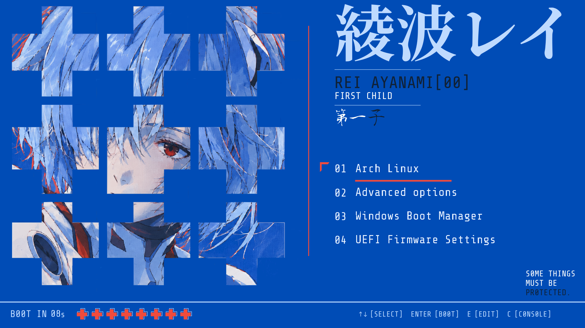
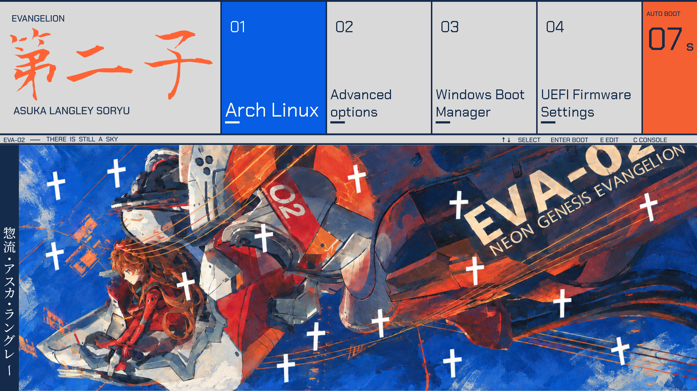
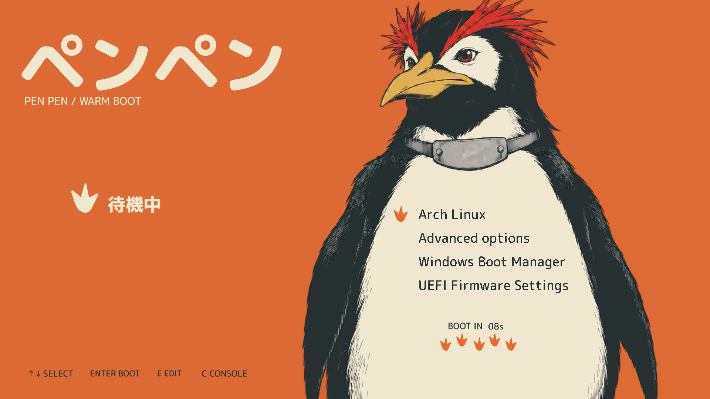
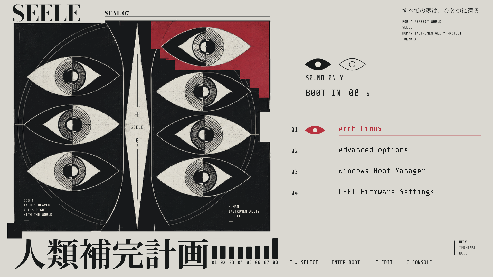
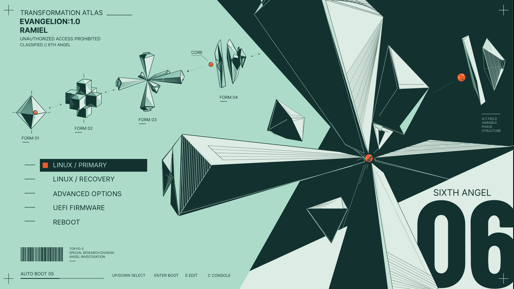

# Evangelion

Eight Evangelion themes for your GRUB boot menu. Each includes 720p, 1080p and 1440p profiles and a matching 4K wallpaper.

## Ayanami



## Soryu



## Pen-Pen



## SEELE



## EVA-01


## Wunder


## EVA-02


## Ramiel



## Install

Requires **Linux** with **GRUB 2**, **Bash**, **awk** and standard Linux command-line tools. Python and jq are not required.

The installer detects `/boot/grub` or `/boot/grub2` and the available GRUB tools. Tested on Arch Linux with GRUB 2.14.

```sh
git clone https://github.com/Aleph1-9012/Evangelion.git
cd Evangelion
sudo ./install.sh
```

Choose a theme and resolution: **720p**, **1080p** or **1440p**. After installation finishes successfully, reboot to see your theme.

Larger display modes can use the 1440p design centered with padding. See the [installation guide](docs/ADVANCED.md) for display options.

Selecting an OS switches to a full-screen console with live boot messages. This is the default for every theme and works with stock GRUB. See [boot behaviour and compatibility](docs/BOOT_CONSOLE.md).

## Switch themes

Run this from any folder:

```sh
sudo eva
```

Choose another theme or resolution. Your selection takes effect on the next boot. For direct selection, use `sudo eva set THEME_ID PROFILE`. Run `eva list` to see the available theme IDs and profiles.

## Uninstall

From the Evangelion folder, run:

```sh
sudo ./install.sh --uninstall
```

You can also run `sudo eva uninstall` from any folder. This restores your previous GRUB theme settings.

## Wallpapers

Download the matching 3840×2160 wallpaper and select it in your desktop wallpaper settings:

- [Ayanami wallpaper](wallpapers/Ayanami-wall.png)
- [Soryu wallpaper](wallpapers/Soryu-wall.png)
- [Pen-Pen wallpaper](wallpapers/Pen-Pen-wall.png)
- [SEELE wallpaper](wallpapers/SEELE-wall.png)
- [EVA-01 wallpaper](wallpapers/EVA01-wall.png)
- [Wunder wallpaper](wallpapers/Wunder-wall.png)
- [EVA-02 wallpaper](wallpapers/EVA-02-wall.png)
- [Ramiel wallpaper](wallpapers/Ramiel-wall.png)

For more options, rollback and known limitations, read the [installation guide](docs/ADVANCED.md).

[License](LICENSE) · [Artwork and font notices](docs/NOTICE.md)
