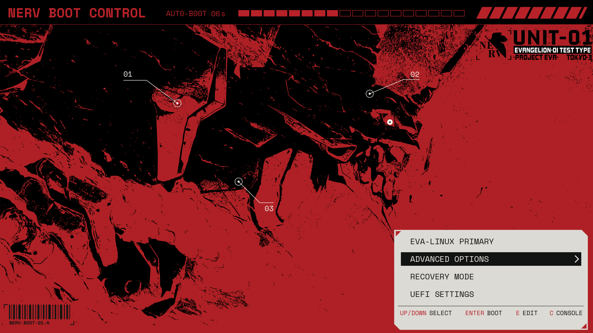
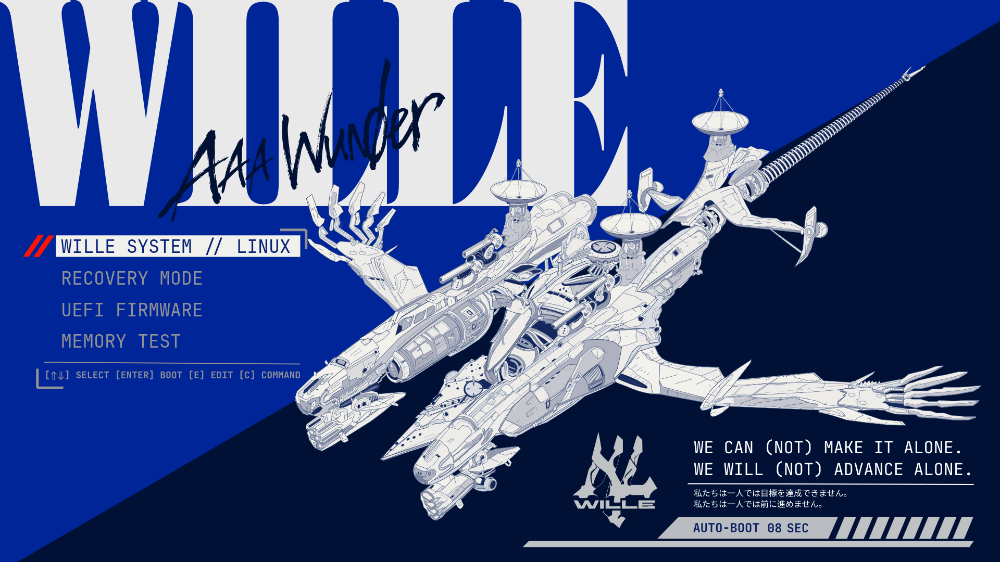
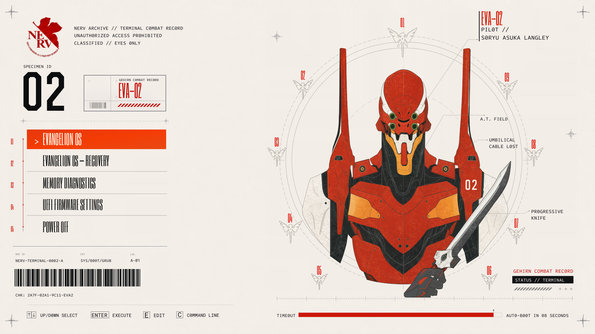

# Evangelion

EVA-01, Wunder and EVA-02 themes for your GRUB boot menu, with matching 4K wallpapers.

## EVA-01



## Wunder



## EVA-02



## Install

Requires **Arch Linux**, **GRUB** already installed, and **Python 3**. Tested with GRUB 2.14.

```sh
git clone https://github.com/Aleph1-9012/Evangelion.git
cd Evangelion
sudo ./install.sh
```

Choose a theme and resolution: **720p**, **1080p** or **1440p**. After installation finishes successfully, reboot to see your theme.

Larger display modes can use the 1440p design centered with padding. See the [installation guide](docs/ADVANCED.md) for display options.

## Switch themes

Run this from any folder:

```sh
sudo eva
```

Choose another theme or resolution. Your selection takes effect on the next boot.

## Uninstall

From the Evangelion folder, run:

```sh
sudo ./install.sh --uninstall
```

You can also run `sudo eva uninstall` from any folder. This restores your previous GRUB theme settings.

## Wallpapers

Download the matching 3840×2160 wallpaper and select it in your desktop wallpaper settings:

- [EVA-01 wallpaper](wallpapers/EVA01-wall.png)
- [Wunder wallpaper](wallpapers/Wunder-wall.png)
- [EVA-02 wallpaper](wallpapers/EVA-02-wall.png)

For more options, rollback and known limitations, read the [installation guide](docs/ADVANCED.md).

[License](LICENSE) · [Artwork and font notices](NOTICE.md)
